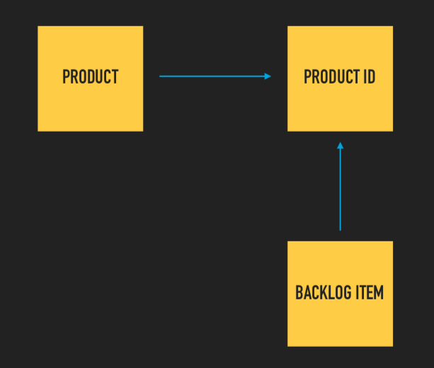
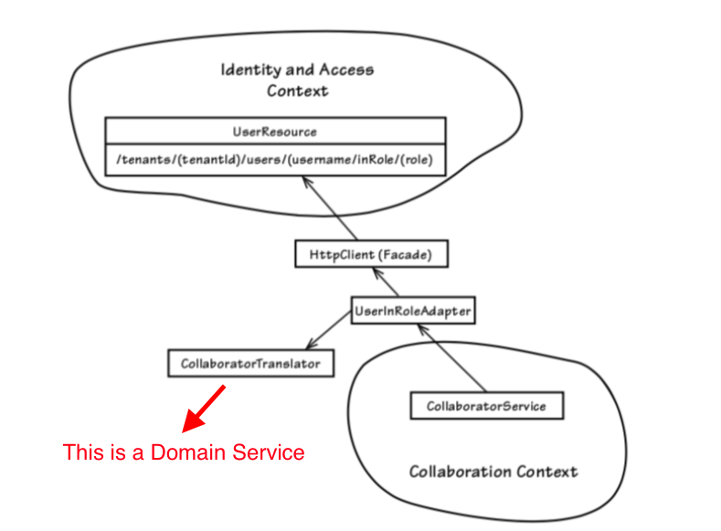
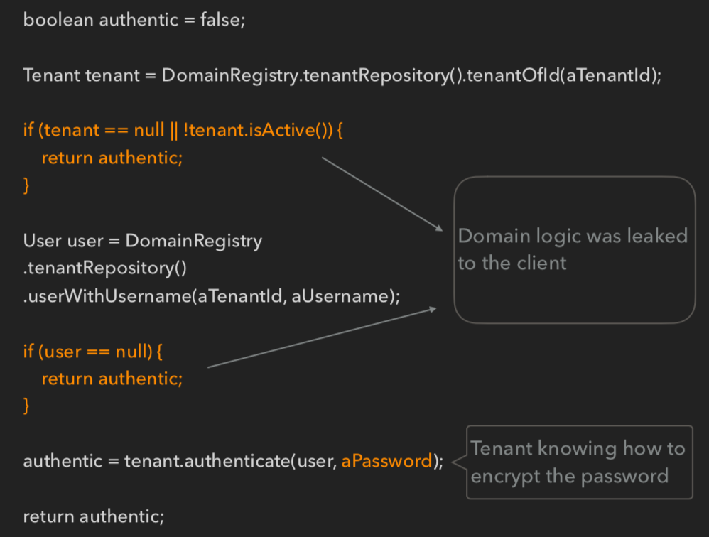
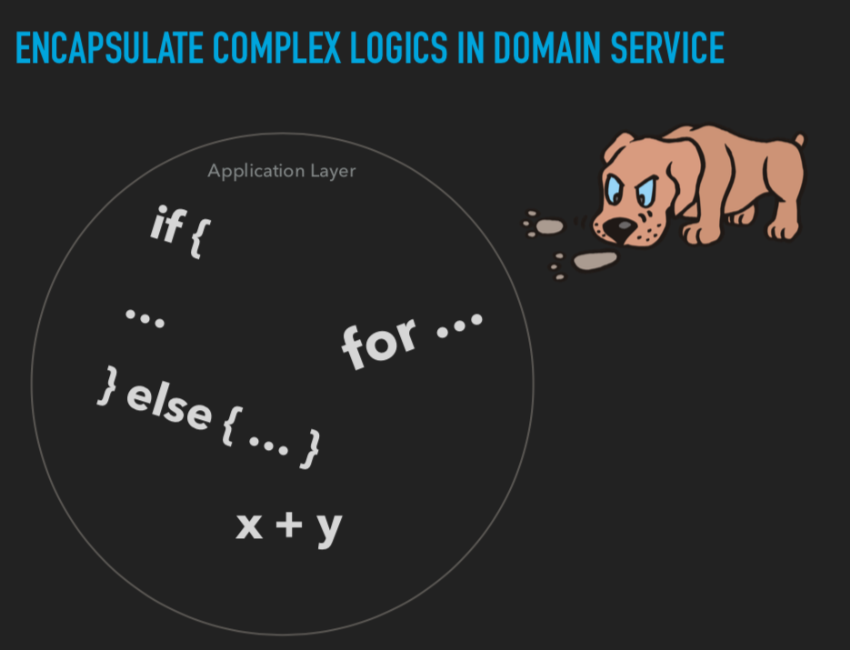
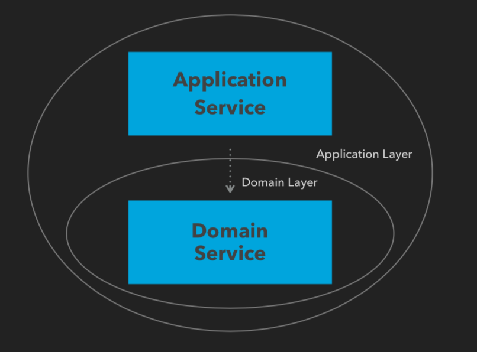
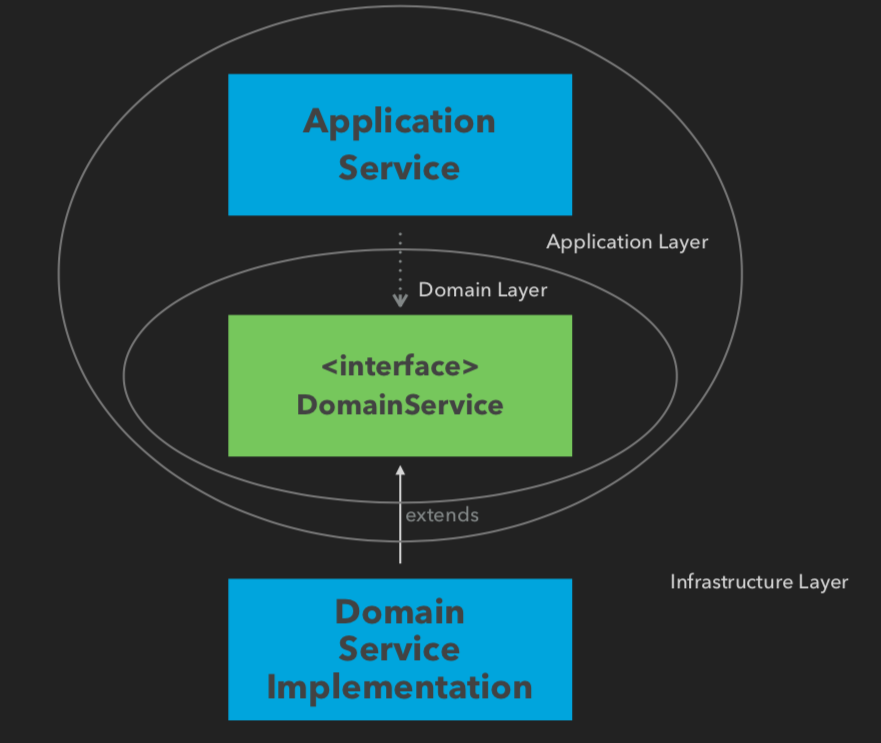

# 領域服務(Domain Service)
在學習了「戰術建模」中很重要的 Eitity 及 Value Object 並且開始嘗試使用它們後，你也許會立刻面臨到「不知道該把一個行為歸屬於一個 Eitity 或另一個 Value Object 上」的問題，此時「領域服務(Domain Service)」將會是你的一方良藥。

 

## 一個簡單的例子
這裡引用到 Vaughn Vernon 所寫的 [Implementing Domain Driven Design](https://www.oreilly.com/library/view/implementing-domain-driven-design/9780133039900/) 中所提到的一個例子: 在一個 Scrum 應用程式中，需要計算在 Product 內所有 backlog items 的權重分數

  

我們首先要新增一個 businessPriorityTotals 方法來計算權重分數，但此時我們將會陷入兩難。

1. 將方法放在 Product 中看似合理，實際上因為 Product 只參考了 Product ID 而不直接攜帶 Backlog Item，我們必需從外部傳入 Backlog Item 到 Product 中做計算，這有可能導致外部需要知道如何取得 Backlog Item 的細節
2. Backlog Item 需要與 Product 放在一起才有意義，這顯得直接將計算方法放在 Backlog Item 並不那麼合適

我們在此時應該導入一個「領域服務(Domain Service)」來緩解這樣的囧境。

 

## 領域服務(Domain Service)的特性
現在讓我們來檢視一個 Domain Service 應該要有哪些特性

### 無狀態(Stateless)
一個 Domain Service 應該要是無狀態(Stateless)的，我們並不關心 Doamin Service 本身的狀態是什麼，更關心的是在它上面的行為，Domain Service 存在的目的就是為了包裝一個複雜的領域行為

### 領域層唯一可調用 Repository 的物件
慣例上並不建議在 Eitity 或 Value Object 內直接調用 Repository 來取得領域物件，會使用 Domain Service 來取得領域物件以及對多個領域物件做交互作用

### 不管理資料一致性(consistency)
使用 transaction 管理資料一致性(consistency) 的操作應該放在 Application Service 做管理

 

## 領域服務(Domain Service)常見使用場景

### 處理一個複雜的商業邏輯
如同前面提到的一個簡單的例子，任何複雜的商業邏輯，如計算、領域物件之間的調用，這樣的複雜行為不能明確的歸屬於某個領域物件時，就可以引入一個 Domain Service

### 將一個領域物件轉換成另一個領域物件
在 Bounded Context 之間的溝通中，我們經常使用 防腐層(ACL) 這樣的一個工具來幫助我們對外部的資料來做一個轉換，使我們得到一個符合 Bounded Context 內部適合的領域物件來做使用，這個轉換的角色，慣例上使用 Domain Service 來做一個轉換者(Translator)的角色

  

### 商業邏輯滲透到外部時
在商業邏輯還不是很複雜的時候，我們一般會在 應用層(application)調用領域物件並對它做些操作，並使用 Repository 將狀態給保存下來，但隨著商業邏輯越來越複雜，一些本應該屬於領域層的邏輯，像是計算、判斷商業獨有的限制條件，很可能會滲透到應用層內(application)

  

因此，我們得特別小心的在應用層(application)裡保持警覺，適時的導入 Domain Service 來封裝商業邏輯

  

 

## 關於架構
在「Clean Architecture」或是「洋蔥式架構」中，Domain Service 存在的方式以及位置有以下兩種

### 實例(Instance)
如果行為沒有與外部溝通或是多型的需求，我們可以直接將 Domain Service 的實作直接定義在領域層(Domain Layer)中供外部調用

  

### 介面(Interface)
若與上述相反則可將 Domain Service 定義為介面(Interface)，而實作定義在基礎設施層(Infrastructure Layer)

  

 

## 貧血模型
Domain Service 不是 "銀子彈"，過度的使用 Domain Service，將會很容易的造成貧血模型這樣子的反模式，因為不經思考的就將所有的行為都放進 Domain Service 來處理。

特別將貧血模型提出來討論是因為現今開發中，我們很常使用「Service Orainted」的方式在做開發(即不管什麼行為，就是放到一個 Service Class 去定義)，這樣導致無法得到一系列有意義且豐富行為的領域物件，以及可能得到一個太過肥大的 Service Class。

 

## 小結
本章我們學習到在領域層(Doamin Layer)內除了 Entity 及 Value Object 以外的另一個舉足輕重的元素「領域服務(Domain Service)」有了這三個重要元素，我們便可以在領域內的設計上更靈活、豐富的安排領域物件之間的相對關係。

 

## 參考資料

1. Eric Evans. (Aug 2003). Domain-Driven Design: Tackling Complexity in the Heart of Software, Addison-Wesley. https://www.oreilly.com/library/view/domain-driven-design-tackling/0321125215/
2. Vaughn Vernon. (Feb, 2013). Implementing Domain Driven Design, Addison-Wesley. https://www.oreilly.com/library/view/implementing-domain-driven-design/9780133039900/

